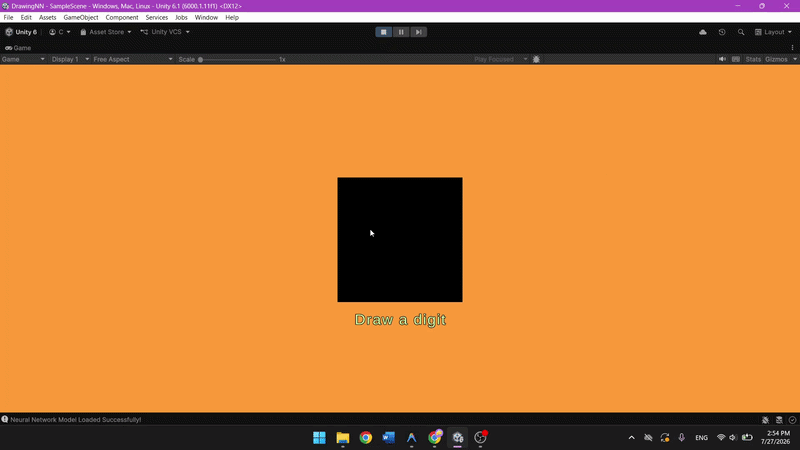

# 🧠 Neural Network & Real-Time MNIST Digit Recognizer from Scratch

A **Custom Neural Network Engine** built in C# (.NET 8) from first principles (without deep learning frameworks like PyTorch or TensorFlow) paired with a **Real-Time Unity Interactive UI** for handwritten digit recognition.

[](https://github.com/v33sergiulica/NeuralNetwork-FromScratch/releases)

---

## 📸 Demo Preview



> 🎮 **Try it yourself**: Download the pre-compiled executable zip from [GitHub Releases](https://github.com/v33sergiulica/NeuralNetwork-FromScratch/releases).

---

## 🌟 Highlights

- **Verified 96.89% Test Accuracy**: Evaluated on 10,000 unseen test images from the official MNIST test dataset.
- **Custom Neural Network Architecture**: Built backpropagation, vector matrix operations, activation functions, and mini-batch gradient descent from scratch.
- **Data Augmentation Pipeline**: Multi-threaded data augmentation (`Parallel.For`) applying random translation ($\pm 2$ px), scaling ($0.85\times - 1.15\times$), rotation ($\pm 15^\circ$), and noise injection to double training set size and boost real-world accuracy on user drawings.
- **Standalone Unity Inference**: Zero-dependency C# inference engine running inside Unity without external DL libraries, reading custom binary serialized weights (`.bin`).
- **Interactive Drawing Canvas**: Smooth 3x3 soft-brush canvas in Unity matching MNIST digit stroke styles, handling coordinate normalization and real-time inference prediction.

---

## 📐 Architecture Overview

```
                      [ Raw MNIST Dataset ]
                                │
                        (Data Augmentation)
                                │
                      [ Training Pipeline ]
                    (MathNet.Numerics / .NET 8)
                                │
                     Saved Model (`model.bin`)
                                │
                    ┌───────────┴───────────┐
                    ▼                       ▼
            Console Benchmark       Unity Inference Engine
              (Evaluation)         (Interactive Canvas UI)
```

### Network Topology

- **Input Layer**: 784 nodes ($28 \times 28$ grayscale pixels, normalized $0.0 - 1.0$)
- **Hidden Layer**: 32 nodes with **ReLU** activation
- **Output Layer**: 10 nodes ($0-9$ digits) with **Softmax** activation
- **Loss & Optimization**: Cross-Entropy Loss, Mini-Batch Gradient Descent (Batch size: 128) with dynamic learning rate decay.

---

## 🔬 Mathematical Implementation Details

### Forward Propagation
$$Z^{[1]} = W^{[1]} X + b^{[1]}, \quad A^{[1]} = \text{ReLU}(Z^{[1]})$$
$$Z^{[2]} = W^{[2]} A^{[1]} + b^{[2]}, \quad A^{[2]} = \text{Softmax}(Z^{[2]})$$

### Backpropagation
$$dZ^{[2]} = A^{[2]} - Y_{\text{one-hot}}$$
$$dW^{[2]} = \frac{1}{m} dZ^{[2]} (A^{[1]})^T, \quad db^{[2]} = \frac{1}{m} \sum dZ^{[2]}$$
$$dZ^{[1]} = (W^{[2]})^T dZ^{[2]} \odot \text{ReLU}'(Z^{[1]})$$
$$dW^{[1]} = \frac{1}{m} dZ^{[1]} X^T, \quad db^{[1]} = \frac{1}{m} \sum dZ^{[1]}$$

---

## 📂 Project Structure

```
├── NeuralNetwok.cs            # Core Training Engine, Data Augmentation & Serialization
├── NeuralNetworkInference.cs   # Standalone Lightweight Inference Engine (Unity compatible)
├── DrawingGrid.cs             # Unity UI Interaction, Soft Brush & Real-Time Prediction
├── NeuralNetwork.csproj       # .NET 8 Console Project Configuration
├── model_augmented.bin        # Pre-trained Binary Model Weights
└── README.md                  # Project Documentation
```

---

## 🚀 Getting Started

### 1. Training the Model (.NET 8 Console App)

1. Download the raw MNIST dataset (`train-images.idx3-ubyte`, `train-labels.idx1-ubyte`, `t10k-images.idx3-ubyte`, `t10k-labels.idx1-ubyte`) and place them in the project root directory.
2. Run the training application:
   ```bash
   dotnet run -c Release
   ```
3. The engine will augment the dataset, run mini-batch gradient descent for 20 epochs, print test accuracy, and save the binary weights to `model_augmented.bin`.

### 2. Unity Integration

1. Copy `NeuralNetworkInference.cs` and `DrawingGrid.cs` into your Unity project (`Assets/Scripts/`).
2. Copy `model_augmented.bin` (or `model.bin`) into `Assets/StreamingAssets/`.
3. Attach `DrawingGrid` to a UI Canvas Image object and reference `NeuralNetworkInference` in the Inspector.
4. Press **Play**, draw digits with left click, and watch predictions update in real-time!

---

## 🛠️ Tech Stack & Dependencies

- **Language**: C# (.NET 8)
- **Math Library**: `MathNet.Numerics` (used exclusively during training for linear algebra)
- **Graphics & UI Framework**: Unity Engine (New Input System, TextMeshPro, Texture2D API)

---

## 👤 Author

Developed by myself as a deep-dive exploration into Neural Networks from first principles and real-time C# inference engines.
